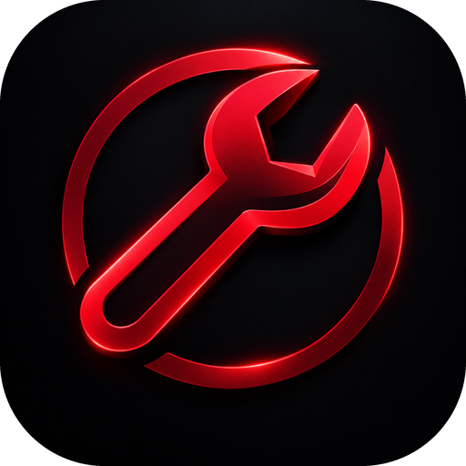

<div align="center">



# MettisTool

**Professional Utility Suite**

221 työkalua · 13 moduulia · 12 kieltä · kaikki käsittely omalla koneellasi

[](https://github.com/santsi0/MettisTool-desktop/releases/latest)
[](#lataa)
[](LICENSE)

[](https://github.com/santsi0/MettisTool-desktop/actions/workflows/build.yml)

**Suomi** · [English](README.en.md)

</div>

---

Asennettava työpöytäsovellus, joka kokoaa yli kaksisataa arkista työkalua yhden
haun taakse — laskimet, muuntimet, tiivisteet, tekstityökalut, verkkolaskurit ja
kehittäjän apuvälineet. Mukana on oikea käyttäjähallinta rooleineen, täysi
audit-loki ja hallintapaneeli.

Tiedot tallennetaan paikalliseen SQLite-tietokantaan omalla koneellasi. Mitään
ei lähetetä verkkoon, ellei jokin yksittäinen työkalu sitä erikseen tarvitse —
ja silloin se sanoo sen.

---

## Lataa

| Käyttöjärjestelmä | Tiedosto | Huomioitavaa |
| --- | --- | --- |
| **Windows** 10 (1809) tai uudempi, 64-bit | [MettisTool-Setup.exe](https://github.com/santsi0/MettisTool-desktop/releases/latest/download/MettisTool-Setup.exe) | Asennus käyttäjäkohtaisesti, ei järjestelmänvalvojan oikeuksia |
| **macOS** 10.15 tai uudempi | [MettisTool.dmg](https://github.com/santsi0/MettisTool-desktop/releases/latest/download/MettisTool.dmg) | Universaali — Apple Silicon ja Intel |
| **Linux** mikä tahansa jakelu | [MettisTool.AppImage](https://github.com/santsi0/MettisTool-desktop/releases/latest/download/MettisTool.AppImage) | `chmod +x` ja käynnistä |
| **Debian · Ubuntu** | [MettisTool.deb](https://github.com/santsi0/MettisTool-desktop/releases/latest/download/MettisTool.deb) | `sudo apt install ./MettisTool.deb` |

### Sovellusta ei ole allekirjoitettu koodivarmenteella

Varmenne maksaa satoja euroja vuodessa, eikä tässä ole sellaista. Käyttöjärjestelmä
huomauttaa siitä ensimmäisellä kerralla:

| | Mitä näet | Mitä teet |
| --- | --- | --- |
| **Windows** | SmartScreen-ilmoitus | *Lisätietoja → Suorita joka tapauksessa* |
| **macOS** | ”Kehittäjää ei voi vahvistaa” | Finderissa *Ctrl-klikkaus → Avaa*, tai `xattr -cr /Applications/MettisTool.app` |
| **Linux** | ei huomautusta | `chmod +x MettisTool.AppImage` |

Halutessasi voit kääntää sovelluksen itse lähdekoodista — [ohjeet alempana](#kääntäminen-itse).

---

## Ensikäynnistys

Sovellus pyytää luomaan **omistajatilin (OWNER)**.

- Omistajatili voidaan luoda **vain** tässä vaiheessa. Sen jälkeen omistajan
  roolin voi myöntää ainoastaan toinen omistaja — ei rekisteröitymällä eikä
  ylläpitäjän toimesta.
- Omistaja näkee koko hallintapaneelin ja voi luoda muita käyttäjiä.

Muut käyttäjät voivat luoda tilin itse, jos rekisteröityminen on sallittu, tai
ylläpitäjä voi luoda tilin ja lähettää kutsun.

---

## Työkalut

| Moduuli | Esimerkkejä |
| --- | --- |
| **Laskurit** | prosentit, laina, ALV, yksikkömuunnokset, tilastot |
| **Kehittäjä** | JSON, Base64, JWT, regex, UUID, cron, diff |
| **Teksti** | muunnokset, analyysi, siivous, sanalaskuri |
| **Kuvat** | pakkaus, muunnos, rajaus, EXIF, väripoiminta |
| **Tiedostot** | tiivisteet, muunnokset, tarkastelu |
| **Turvallisuus** | salasanat, hashit, TOTP, vuototarkistus |
| **Web** | URL, DNS, otsakkeet, robots.txt, sivukartta |
| **Design** | värit, gradientit, varjot, CSS |
| **Data** | CSV, JSON, taulukot, tilastot |
| **Aika** | aikavyöhykkeet, ajastimet, päivämäärät |
| **Tuottavuus** | muistiinpanot, tehtävät, pomodoro |
| **Verkko** | IP, portit, aliverkot, kantaluvut |
| **Tekniikka** | fysiikka, sähkö, mekaniikka |

Työkalut toimivat **kokonaan paikallisesti**. Neljä käyttää valinnaisesti julkista
rajapintaa — valuuttakurssit, DNS-kysely, oma IP-osoite ja salasanavuotojen
tarkistus k-anonymiteetillä. Ne kertovat verkkotarpeesta selvästi, ja loput 217
toimivat myös ilman verkkoa.

---

## Ominaisuudet

### Käyttäjähallinta

- Sähköposti ja salasana, valinnainen **Google-kirjautuminen**
- **Kaksivaiheinen tunnistautuminen** (TOTP) ja palautuskoodit
- Roolit **USER · MODERATOR · ADMIN · OWNER** ja 12 tarkempaa oikeutta
- Istuntojen hallinta: näet omat istuntosi ja voit katkaista ne
- Salasanan palautus ja sähköpostin vahvistus kertakäyttöisillä koodeilla

### Hallintapaneeli

Yleiskuva tilastoineen ja 14 päivän kaavioineen, käyttäjien hallinta,
ylläpitotilit, turvallisuusasetukset, audit-loki hakuineen ja CSV-vienteineen,
sähköpostiasetukset, Discord-lokitus, järjestelmätiedot ja varmuuskopiot.

### Muuta

- Teemat: tumma, tummempi, vaalea tai järjestelmän mukaan — ja viisi korostusväriä
- 12 käyttöliittymäkieltä
- Ilmaisinalueen kuvake, käynnistys järjestelmän mukana, ilmoitukset
- Päivitystarkistus GitHub Releasesista — ei koskaan automaattista asennusta

---

## Turvallisuus

| Asia | Toteutus |
| --- | --- |
| **Salasanat** | Argon2id (m = 19 MiB, t = 2, p = 1), satunnainen suola. Ei koskaan selkokielisenä, ei lokiin, ei Discordiin. |
| **Kirjautuminen** | Vakioaikainen vertailu, valeverifiointi tuntemattomalle tilille, yritysten rajoitus ja tilin lukitus. |
| **Istunnot** | Token luodaan satunnaisesti ja tallennetaan **SHA-256-tiivisteenä**. Raakatoken ei koskaan kulje IPC:n yli käyttöliittymälle. |
| **”Muista minut”** | Pitkäikäinen token vain käyttöjärjestelmän salatussa avainsäilössä. |
| **Koodit** | Vahvistus-, palautus- ja kutsukoodit ovat kryptografisesti satunnaisia, kertakäyttöisiä, vanhenevia ja tietokannassa tiivisteinä. |
| **2FA** | TOTP (RFC 6238). Avain avainsäilössä, palautuskoodit Argon2-tiivisteinä. |
| **Salaisuudet** | Resend-avain, Google-tunnukset ja Discord-webhook vain avainsäilössä. Käyttöliittymä näyttää vain peitetyn muodon. |
| **Oikeudet** | Tarkistetaan aina palvelinkerroksessa. OWNER-roolia ei voi saada rekisteröitymällä; vain omistaja voi myöntää sen. Viimeistä omistajaa ei voi poistaa. |
| **Tietokanta** | Kaikki kyselyt parametrisoituja. Ei merkkijonojen yhdistelyä SQL:ään. |
| **Auditointi** | Jokainen turvallisuus- ja hallintatapahtuma kirjataan. Lokista suodatetaan automaattisesti salasanat, tiivisteet, tokenit ja avaimet. |
| **Discord** | Valinnainen ja taustalla. Viesti käy saman suodatuksen läpi — salaisuuksia ei koskaan lähetetä. |
| **Verkko** | Sisältöturvakäytäntö sallii vain neljä nimettyä rajapintaa. Muut yhteydet estetään selainmoottorin tasolla. |
| **Google** | Authorization Code + PKCE ja paikallinen takaisinkutsu. **Sovellus ei koskaan kysy eikä tallenna Google-salasanaa.** |

**Perusperiaate:** käyttöliittymässä ei ole yhtäkään turvallisuuspäätöstä.
Frontend näyttää ja piilottaa asioita käytettävyyden vuoksi, mutta jokainen
komento tarkistaa Rust-puolella istunnon, roolin, tilin tilan ja oikeudet
uudelleen tietokannasta. Frontendin manipulointi ei anna lisäoikeuksia.

Jos löydät tietoturvaongelman, ilmoita siitä Issues-sivulla — älä liitä mukaan
oikeita tunnuksia tai lokitiedostoja.

---

## Salaisuudet käyttöjärjestelmän avainsäilössä

| Alusta | Säilö |
| --- | --- |
| Windows | Credential Manager (DPAPI-suojattu) |
| macOS | Keychain |
| Linux | Secret Service — GNOME Keyring tai KWallet |

> **Linux:** jos työpöytäympäristössä ei ole Secret Service -palvelua, salaisuuksia
> ei voi tallentaa. Sovellus toimii silti; ”muista minut” ja API-avaimet vain eivät
> säily istunnon yli. Useimmissa työpöytäjakeluissa palvelu on valmiina.

---

## Sähköposti, Google ja Discord

Kaikki kolme ovat **valinnaisia**. Ilman niitä sovellus toimii täysin, mutta:

- ilman sähköpostia vahvistus- ja palautuskoodeja ei voi lähettää
  (ylläpitäjä voi vahvistaa tilin ja asettaa salasanan käsin),
- ilman Google-tunnuksia Google-kirjautuminen ei näy kirjautumisruudussa,
- ilman webhookia Discord-lokitus on pois käytöstä.

Asetukset tehdään sovelluksen sisällä: **Hallinta → Sähköposti / Turvallisuus / Discord**.
Tiedot tallentuvat avainsäilöön. `.env.example` kuvaa vaihtoehtoiset
ympäristömuuttujat kehityskäyttöä varten.

### Sähköpostiin koodit, ei linkkejä

Työpöytäsovelluksessa ei ole palvelinta, jolle selain voisi palata. Siksi
vahvistus-, palautus- ja kutsuviestit sisältävät **koodin**, jonka kirjoitat
sovellukseen. Koodi on kertakäyttöinen ja vanhenee.

---

## Tietojen sijainti ja varmuuskopiot

| Alusta | Kansio |
| --- | --- |
| Windows | `%APPDATA%\fi.mettistool.desktop\` |
| macOS | `~/Library/Application Support/fi.mettistool.desktop/` |
| Linux | `~/.local/share/fi.mettistool.desktop/` |

Pääset kansioon suoraan sovelluksesta: **Asetukset → Tietokansio → Avaa tietokansio**.

- Automaattinen varmuuskopio tehdään enintään kerran vuorokaudessa käynnistyksen
  yhteydessä. Voit kytkeä sen pois hallintapaneelista.
- Manuaalisen varmuuskopion voi luoda kohdassa **Hallinta → Järjestelmä**.
- Palautus on omistajan oikeus. Ennen palautusta nykyisistä tiedoista tehdään
  turvakopio automaattisesti.
- Sovelluksen poistaminen ei poista tietokantaa. Voit poistaa kansion käsin,
  jos haluat hävittää kaiken.

---

## Kielet

Käyttöliittymä on saatavilla 12 kielellä: **suomi, englanti, ruotsi, saksa,
ranska, espanja, italia, portugali, hollanti, puola, norja ja tanska**. Kielen voi
vaihtaa kirjautumisruudussa ja kohdassa **Asetukset → Kieli**.

Käännökset ovat tiedostoissa `src/i18n/locales/*.json`. Uuden kielen lisääminen:
kopioi `fi.json`, käännä arvot ja lisää kieli `src/i18n/index.tsx`-tiedoston
`LANGUAGES`-listaan sekä Rustin `util::valid_language`-funktioon.

> Työkalujen nimet, kuvaukset ja niiden omat tekstit ovat suomeksi. Käyttöliittymän
> muut osat — kirjautuminen, kuori, tili, asetukset, hallintapaneeli ja
> työkalunäkymän ohjaimet — noudattavat valittua kieltä.

---

## Kääntäminen itse

### Vaihtoehto 1 — GitHub Actions (suositeltu)

Repositoriossa on työnkulku, joka kääntää sovelluksen kaikille kolmelle alustalle
eikä vaadi sinulta mitään asennuksia.

1. Työnnä koodi omaan repositorioosi. Työnkulku on tiedostossa
   `.github/workflows/build.yml`. Jos sait projektin ilman `.github`-kansiota,
   luo se ja kopioi sisältö tiedostosta `build-workflow.yml.txt`.
2. Avaa **Actions → Rakenna sovellus → Run workflow**.
3. Noin 15–25 minuutin kuluttua asennuspaketit ovat kohdassa *Artifacts*.
   Artefaktit vanhenevat 30 päivässä ja latautuvat aina zip-pakattuna — se on
   GitHubin toiminta, johon työnkulku ei voi vaikuttaa.

Version-tagi julkaisee paketit Release-sivulle, jossa ne latautuvat sellaisenaan:

```bash
git tag v1.0.0
git push origin v1.0.0
```

### Vaihtoehto 2 — oma kone

Tarvitset [Node.js 20+](https://nodejs.org/) ja [Rustin](https://rustup.rs/) sekä
alustakohtaiset työkalut:

| Alusta | Lisäksi |
| --- | --- |
| Windows | [Visual Studio Build Tools](https://visualstudio.microsoft.com/downloads/) — työkuorma *Desktop development with C++*; WebView2 (valmiina Windows 11:ssä) |
| macOS | Xcode Command Line Tools: `xcode-select --install` |
| Linux | `libwebkit2gtk-4.1-dev libgtk-3-dev libayatana-appindicator3-dev librsvg2-dev libxdo-dev libdbus-1-dev libssl-dev patchelf build-essential` |

```bash
npm install
npm run start        # kehitystila, automaattinen uudelleenlataus
npm run build:app    # tuottaa asennuspaketin omalle alustallesi
```

Valmis paketti löytyy kansiosta `src-tauri/target/release/bundle/`.

Muut komennot:

```bash
npm run typecheck    # TypeScript-tarkistus
cargo fmt --check    # Rustin muotoilu (hakemistossa src-tauri)
cargo clippy         # Rust-lint
```

---

## Arkkitehtuuri

```
MettisTool
├── src/                 React 18 + TypeScript 5.7 + Vite 6
│   ├── api/             typoitu IPC-kerros (vastaa 1:1 Rustin komentoja)
│   ├── i18n/            käännösjärjestelmä + 12 kielitiedostoa
│   ├── screens/         kirjautuminen, etusivu, tili, asetukset, hallinta
│   ├── shell/           yläpalkki, sivupalkki, sovelluskuori
│   ├── state/           istunto, teema, reititys, ilmoitukset, työkalut
│   ├── tools/           työkalumoottorin lataus ja tyypit
│   └── ui/              käyttöliittymäpalikat ja ikonit
├── public/tools/        työkalumoottori ja 221 työkalua (vanilla JS)
└── src-tauri/           Rust-taustalogiikka, 88 IPC-komentoa
    ├── nsis/            Windows-asennusohjelman suomenkieliset tekstit
    ├── src/auth/        salasanat, istunnot, tokenit, TOTP, OAuth, rajoitukset
    ├── src/commands/    IPC-komennot
    ├── src/db/          SQLite, migraatiot, tietomallit
    └── src/*.rs         RBAC, auditointi, sähköposti, Discord, varmuuskopiot
```

Työkalumoottori on erillinen kerros: se saa käyttöönsä vain oman tallennustilansa
(`tool_state`-taulu käyttäjäkohtaisesti) eikä näe istuntoa, tokeneita eikä
salaisuuksia.

---

## Vianetsintä

<details>
<summary><strong>Sovellus ei käynnisty tai ikkuna jää mustaksi</strong></summary>

**Windows:** WebView2 puuttuu. Asenna se Microsoftin sivulta (*Evergreen Standalone Installer*).
**Linux:** puuttuu `libwebkit2gtk-4.1`. Asenna jakelusi paketinhallinnasta.
</details>

<details>
<summary><strong>Unohdin omistajatilin salasanan eikä sähköpostia ole määritetty</strong></summary>

Sulje sovellus, siirrä tietokanta (`mettistool.db`) yllä olevasta tietokansiosta
talteen ja käynnistä sovellus uudelleen — ensikäynnistys alkaa alusta. Vanhat
tiedot säilyvät siirtämässäsi tiedostossa.
</details>

<details>
<summary><strong>Sähköpostit eivät lähde</strong></summary>

Tarkista **Hallinta → Sähköposti**: API-avain, lähettäjän osoite (domainin on
oltava vahvistettu Resendissä) ja viimeisin virheilmoitus.
</details>

<details>
<summary><strong>Google-kirjautuminen epäonnistuu</strong></summary>

Varmista, että OAuth-asiakas on tyyppiä *Desktop app*. Selain avautuu erikseen;
sovellus ei koskaan kysy Google-salasanaa.
</details>

<details>
<summary><strong>Haluan nähdä mitä sovellus tekee</strong></summary>

Käynnistä komentoriviltä lokitason kanssa:

```powershell
$env:METTISTOOL_LOG="debug"; .\MettisTool.exe        # Windows
```

```bash
METTISTOOL_LOG=debug ./MettisTool.AppImage           # Linux
METTISTOOL_LOG=debug /Applications/MettisTool.app/Contents/MacOS/MettisTool
```
</details>

---

## Lisenssi

[MIT](LICENSE) © 2026 MettisTool

<div align="center">

Rakennettu [Taurilla](https://tauri.app), [Reactilla](https://react.dev) ja [Rustilla](https://www.rust-lang.org).

</div>
